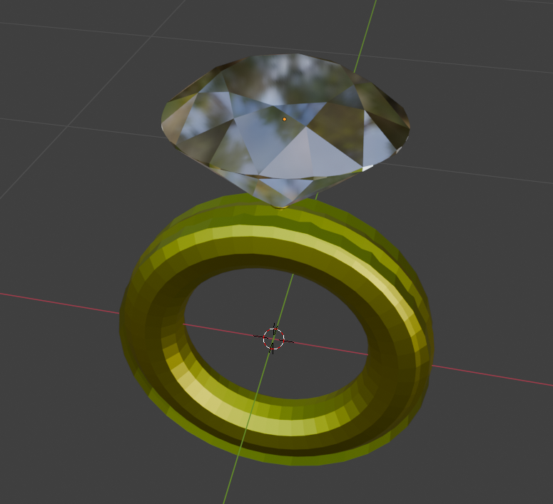

# 💍 Diamond Ring (Blender Project)

A 3D-modelled **diamond ring** created in **Blender**, featuring a gold band, a faceted diamond, and a custom multi-layered support structure designed to hold the stone securely and distribute weight evenly.

---

## Description

This project showcases:

- A gold ring base  
- A faceted diamond with transmission/IOR for realistic refraction  
- Multiple small support rings and prongs to stabilize the stone  
- A stepped seating system so the diamond’s tip sits safely inside the ring  
- Geometry arranged to avoid the diamond tip entering the finger area

This repo is intended for learning, showcasing progress, and sharing a reusable 3D asset.

---

## Blender Details

- **Software:** Blender  
- **Main file:** `ring.blend`  
- **Notable features:**
  - Gold material (metallic + roughness)  
  - Diamond material (transmission + IOR)  
  - Subdivision Surface + Smooth Shading  
  - Multi-layer support structure beneath the stone

---

## Files

├── ring.blend
├── 6feca32a-09ce-4f8d-914f-1e706bfcaae6.png
├── LICENSE
└── README.md

---

## License

This project is released under the **MIT License**.

---

## Future improvements

- Add high-resolution renders for the preview  
- Refine prongs and internal seating for manufacturability  
- Add HDRI lighting and polished materials  
- Exports: `.obj`, `.fbx` for other platforms
